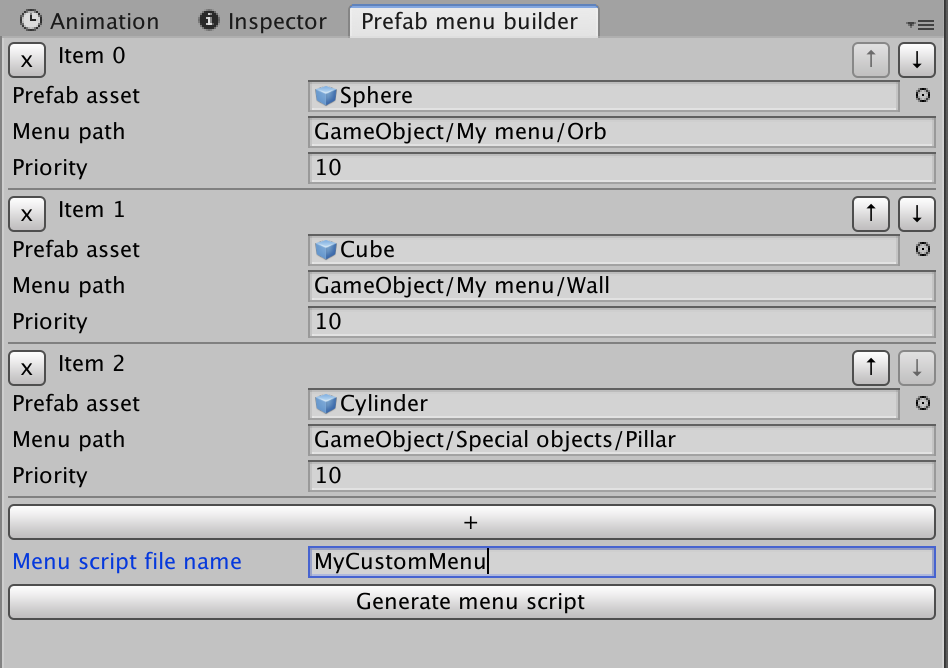
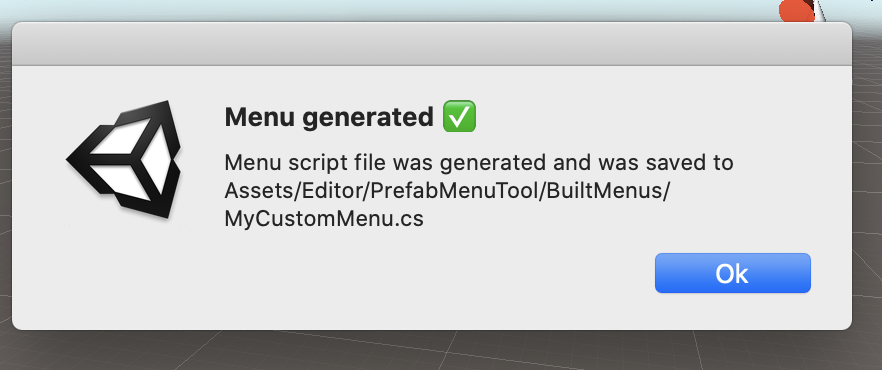
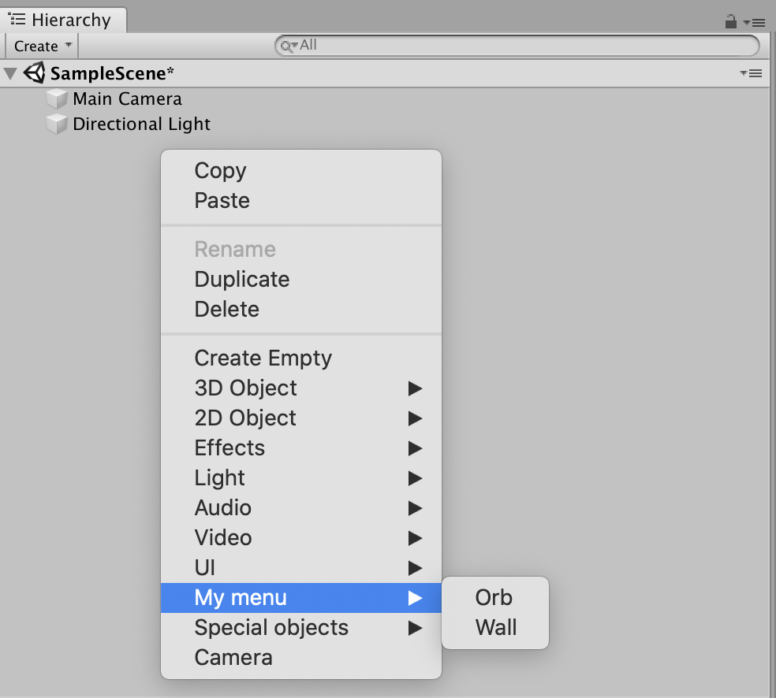

# Prefab Menu Tool
Unity custom editor tool

Add your own prefabs to the GameObject menu

#### Configure in the editor

#### Generate a C# file

#### Your prefabs can now be instantiated from the GameObject menu

## Installation
- Download the package
- Import the package into your Unity project with Assets -> Import Package -> Custom Package

## Usage
- Open the configuration menu with Tools -> Prefab Menu Builder
- Click the + button to add an item
- Fill out the fields to set the prefab, menu item path and priority
  - See the [MenuItem docs](https://docs.unity3d.com/ScriptReference/MenuItem-ctor.html) for more info on menu item path and priority
- Use the x button to remove an item
- Use the arrow buttons to rearrange the items
- Click the "Generate menu script" to generate the menu
- Wait for the new script to compile
- Right-click in the hierarchy and your new menu items should appear

## Compatibility
Made with Unity 2018.4.13f1
